Same doc with math equations properly displayed can be found in [github page](https://bingo-todd.github.io/work/2019/09/27/gtf_baseband_implementation.html)

# Gammatone-filters
Python implementation of all-pole Gammatone filter.
The filtering part of code is written in c.

## Basic idea of implementation [^Holdsworth1988]
Gammatone filter can be regarded as low-pass filter with frequency shitfted by cf(center freuqency of filter). Equalently, we can
1. Shift the frequency of input signal by -cf(center frequency of filter);
2. Filter shifted signal with corresponding lowpass filter
3. Shift the frequency of filtered signal back by cf.


## Comparison with other module
Detly has published a [python module](https://github.com/detly/gammatone) of gammatone filterbank.
Using the sample settings, outputs of Detly module and current module are as follow:

```
fs=16kHz
cfs = [100 393  948 2000]
```

<table>
<tr> <td>Detly</td> <td> 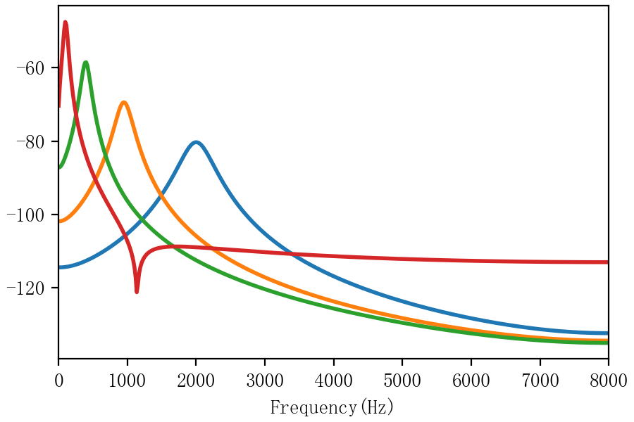 </td> </tr>
<tr>
<td> Current </td> <td>  </td>
</tr>
</table>


**Difference** 

In Delty's code,  given the low and high frequencies($low\_freq$, $high\_freq$ and the number of bands($n$), $n+1$ frequency points are sampled equally in $ERB scale$, the first $n$ frequency points are used as the center frequency bands. This can be reasonable only if $n$  is appropriate, for example,

<table>
    <tr>
        <td> n=4 </td>
        <td> n=8 </td>
        <td> n=16 </td>
        <td> n=32 </td> 
    </tr>
    <tr>
        <td>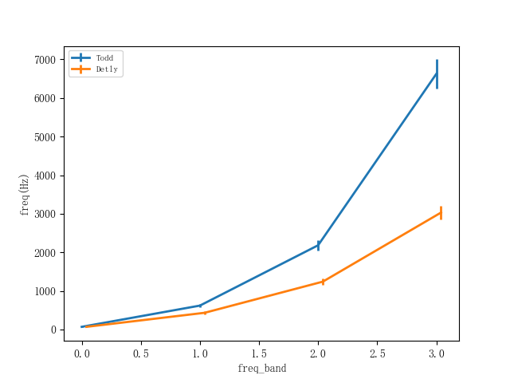</td>
        <td>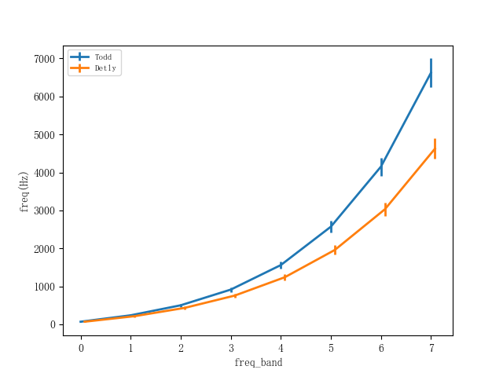</td>
        <td>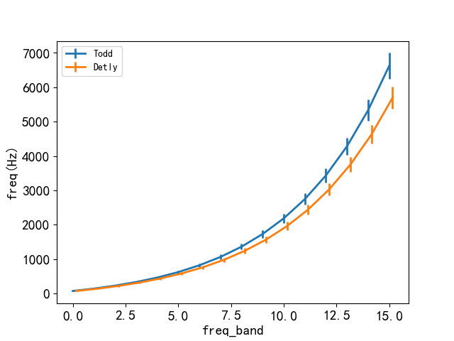</td>
        <td>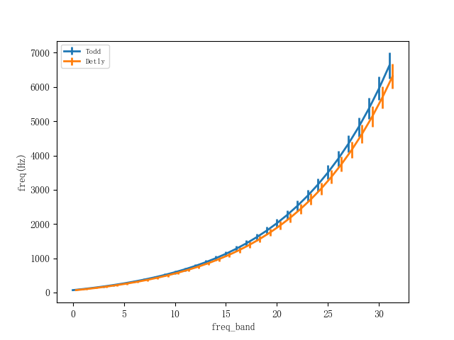</td>
    </tr>
</table>

In this module, there are two ways to ways to specified the frequency range:

1. freq_low, freq_high: the frequency range of ERB

2. cf_low, cf_hight: the frequency range of center frequencies

   eg, frequency range [70, 7000], n=4

   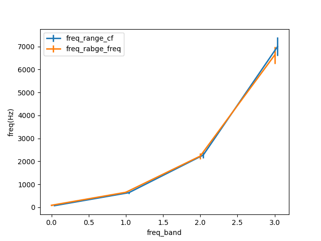

## Spectrum of filter

Taking filter with $f_c=4kHz$ as example, the amplitude spectrum $$gain(f)$$ and phase spectrum $$\phi(f)$$ is plotted as follow

  <table align="center">
  <tr>
  <td align=center> amp & phase </td>
  <td align=center> amp & delay </td> </tr>
  <tr>
  <td> 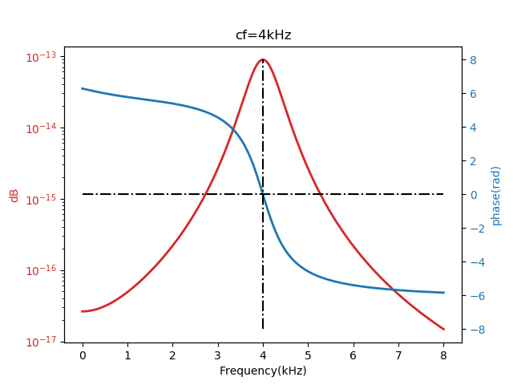 </td>
  <td> 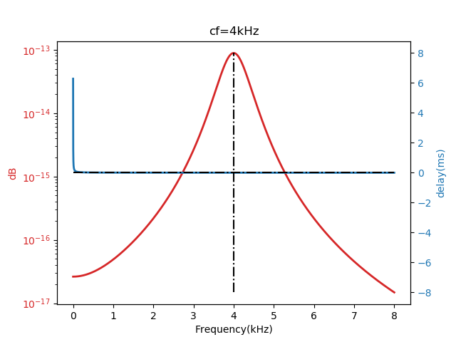 </td>
  </tr>
  </table>

  As shown in figure,

  - $ \phi(f_c)\approx 0 $;
  - Amplitude of $$\phi(f)$$ increase as $$f$$ move away from $$f_c$$;

  Gain and delay at cf as function of cf
  <center> 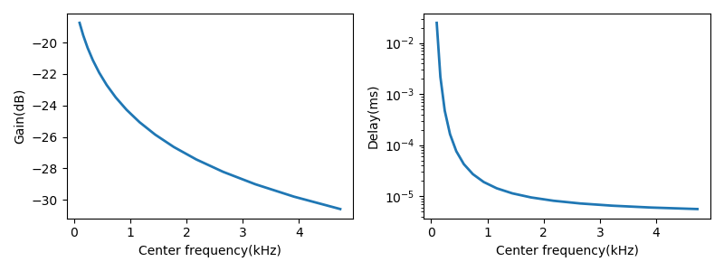 </center>
## Gain normalization

  Gammatone filter is normalized by scaling filter gain at fc to 1
  - IRs before gain normalization
  <center> 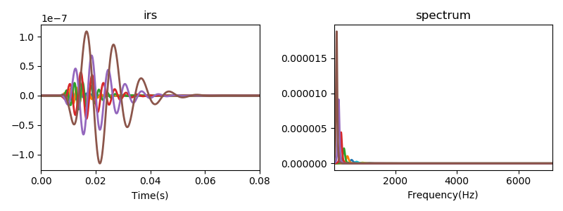 </center>
  - IRs after gain normalization
  <center> 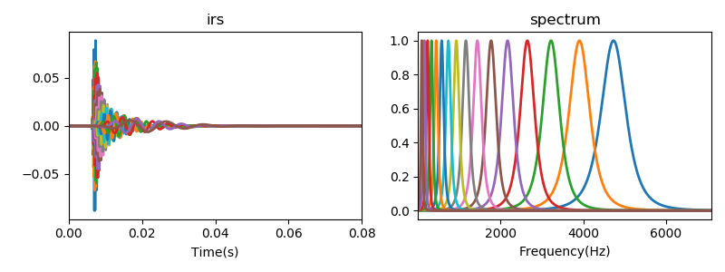 </center>
## Phase compensation

  Phase compensation is actually to align the peaks of all filter impulse response[^Brown1994].

  The impulse response of Gammatone filter is given as


$$
\begin{equation}
\begin{aligned}
g(t) = a\frac{t^{n-1}\cos(2\pi f_ct+\phi)}{e^{2\pi b t}}
\end{aligned}
\end{equation}$$
$$

  <center> 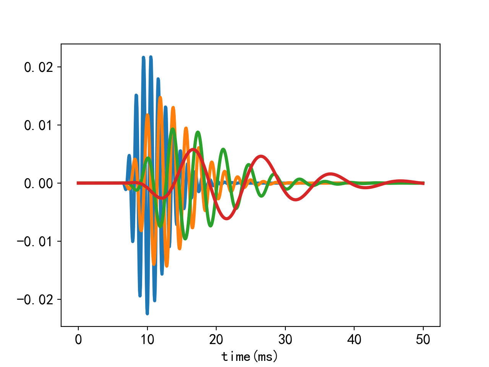 </center>
  $$g(t)$$ can be be regarded as production of two parts :

$$
\begin{equation}
  \begin{aligned}
   g(t)=g_{amp}(t)\times g_{fine}(t)
  \end{aligned}
  \end{equation}
$$

  - Envelope parts:   $$\quad g_{amp}(t) = a\frac{t^{n-1}}{e^{2\pi b t}}$$
  - Fine structure part: $$\quad g_{fine}(t) = \cos(2\pi f_ct+\phi)$$

### Envelope alignment
  The peak position $t_{peak}$ can be obtained by setting first-order derivative of $g_{amp}(t)$ to 0

$$
\begin{equation}
  \begin{aligned}
  \frac{\partial g_{amp}(t)}{\partial t} &= \frac{(n-1)t^{n-2}}{e^{2\pi bt}}-\frac{t^{n-1}2\pi b}{e^{2\pi bt}}\\
  &=\frac{t^{n-2}}{e^{2\pi bt}}(n-1-2\pi bt) \triangleq 0\\
  \Rightarrow& \quad t_{peak}=\frac{(n-1)}{2\pi b}
  \end{aligned}
  \end{equation}
$$
  Delay $g_{amp}$ by $-t_{peak}$ to align the peaks of filter bank

$$
\begin{equation}
  \begin{aligned}
  g_{align}(t) = g_{amp}(t-\tau)g_{fine}(t)
  \end{aligned}
  \end{equation}
$$


  Example of $$g_{align}$$ ($$\phi$$ is set to 0)
  <center> 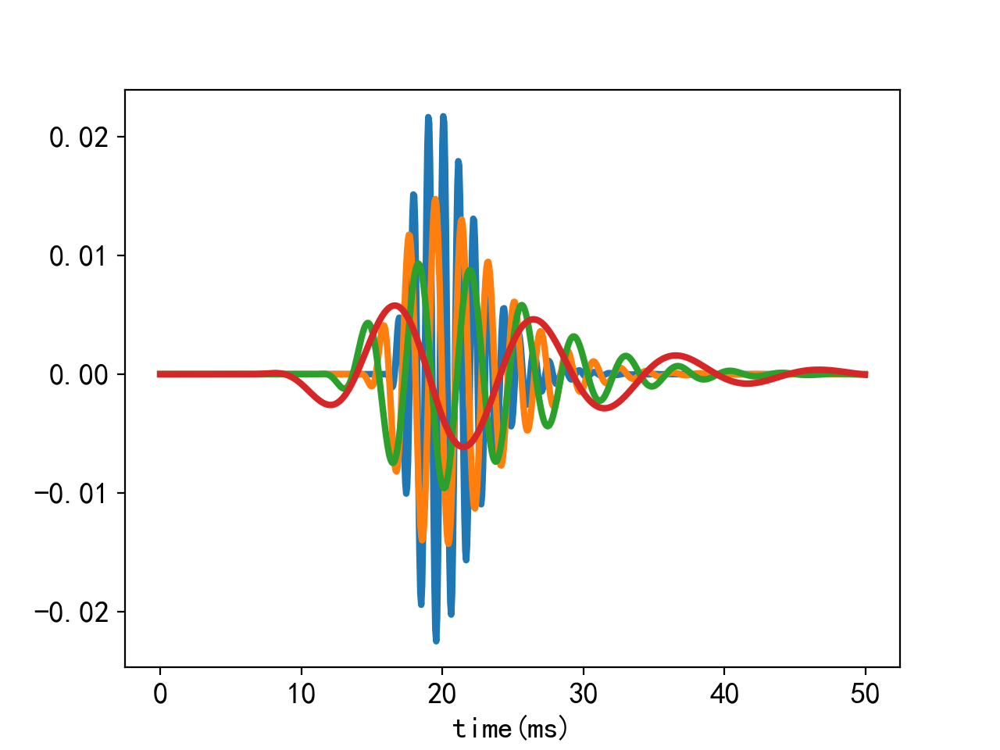 </center>
### Fine structure alignment
  Further more, align $$g_{fine}(t)$$

$$
  \begin{equation}
  \begin{aligned}
  & \cos(2\pi f_ct+\phi)|_{t=t_{max}} \triangleq 1\\
  \Rightarrow& \quad  \phi = -\frac{(n-1)f_c}{b}+i2\pi, \quad i=0,\pm 1,\cdots
  \end{aligned}
  \end{equation}
$$

  <center> 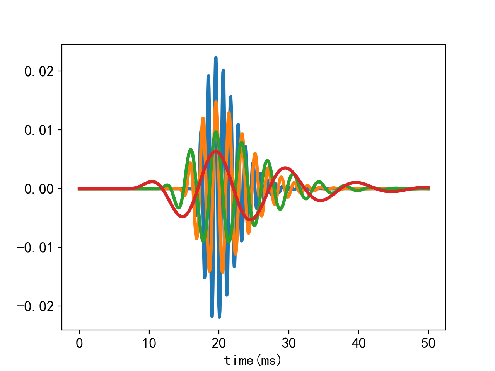</center>
### Illustration of purpose of alignment

  For a stimulus of impulse, what if we add up all filter outpus ?  Ideally, a impulse is expected

  <table>
  <tr>
  <td align=center> Not aligned </td>
  <td align=center> Envelope aligned </td>
  <td align=center> Envelop & fine structure aligned </td>
  </tr>
  <tr>
  <td> <center> 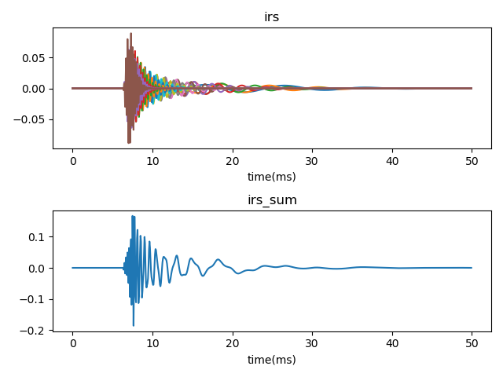 </center> </td>
  <td>   <center> 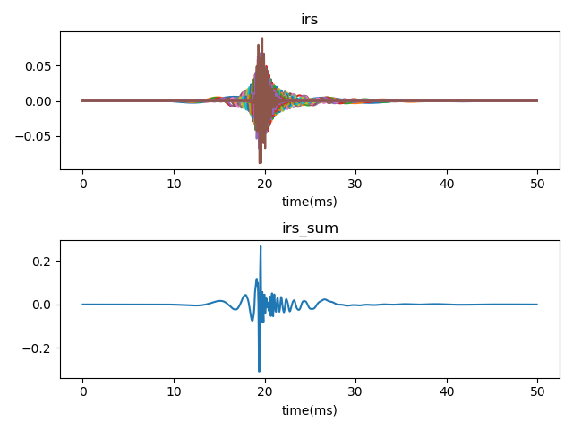 </center> </td>
  <td>   <center> </center> </td>
  </tr>
  </table>

## About efficiency

```shell
 python .\efficiency.py
 #time consumed(s) for filtering signal with length of 16e3 samples
 #     c  :0.11
 #     python  :11.81
```

## Built-in examples

Corresponding to above-mentioned tests

```
validate.py
efficiency.py
filter_spectrum.py
gain_normalization.py
phase_compensation.py
stimulus_restore.py
```


[^Holdsworth1988]: Holdsworth, John, Roy Patterson, and Ian Nimmo-Smith. Implementing a GammaTone Filter Bank

[^Brown1994]: G. J. Brown and M. P. Cooke (1994) Computational auditory scene analysis. Computer Speech and Language, 8, pp. 297-336
