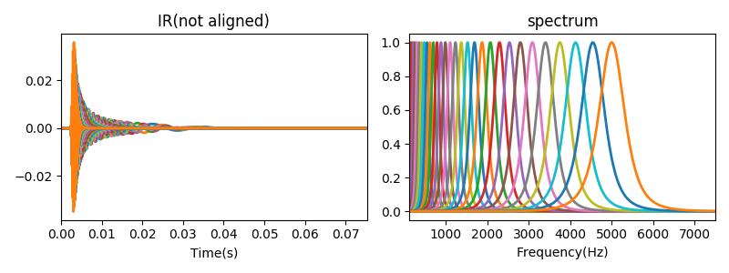
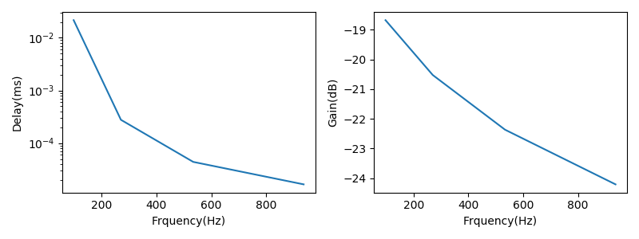
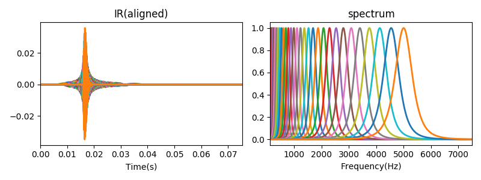

# Gammatone-filters
Python implementation of all-pole Gammatone filter.
The filtering part of code is written in C.
## Basic ideas [^Holdsworth1988]
Gammatone filter can be regarded as low-pass filter with frequency shitfted by fc. Now, equalently, we can first shift input signal by -fc and filter it with a lowpass filter, finally shift the frequency by fc.
!

Details, see [README.pdf](README.pdf), currently written in Chinese, but most part are math equations.

## Example
```Python
gtf = APGTF(fs=44100,low_cf=80,high_cf=5000,N_band=32)
x_filtered = gtf.filter_c(x,is_aligned=0)# not aligned
```
## Impulse response of Gammatone filters



delay and gain at center frequency


basically, the phase delay at center frequency approximates 0.

### Phase compensation
Phase compensatio is actually to align the peaks of all filter impulse response[^Brown1994].



Next, I want to make summary about signal recovery after filtered by Gammatone filters.[Flag]

### About efficiency
```python
gtf = APGTF(fs=44100,low_cf=80,high_cf=5000,N_band=32)
gtf.plot_gtf(version='c') # filter written in c
gtf.plot_gtf(version='py') # filter written in python
```
Excute time
```shell
Version:c  Excute time: 4.41s
Version:py  Excute time: 291.49s
```
Computer settup


[^Holdsworth1988]: Holdsworth, John, Roy Patterson, and Ian Nimmo-Smith. Implementing a GammaTone Filter Bank

[^Brown1994]: G. J. Brown and M. P. Cooke (1994) Computational auditory scene analysis. Computer Speech and Language, 8, pp. 297-336
