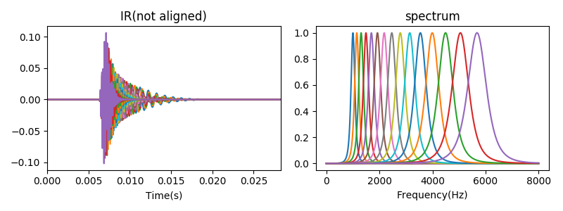
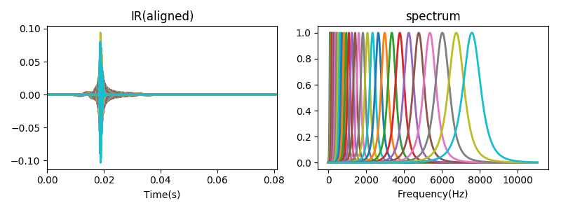

# Gammatone-filters
Python implementation of all-pole Gammatone filter. 
The filtering part of code is written in C.

## Basic ideas [^Holdsworth1988]
Gammatone filter can be regarded as lowpass filter with frequency shitfted by fc. Now, equalently, we can first shift input signal by -fc and filter it with a lowpass filter, finally shift the frequency by fc.

Algorithm details, see [README.pdf](README.pdf), currently written in Chinese,but most part are math equations.

## Impulse response of Gammatone filters

delay and gain at center frequency

basically,the phase delay at center frequency approximates 0. 

### Phase compensation
Phase compensatio is actually to align the peaks of all filter impulse response[^Brown1994], sincee the phase delay at center frequency is already approximate 0.

Next, I want to make summary about signal recovery after filtered by Gammatone filters. 

[^Holdsworth1988]: Holdsworth, John, Roy Patterson, and Ian Nimmo-Smith. Implementing a GammaTone Filter Bank

[^Brown1994]: G. J. Brown and M. P. Cooke (1994) Computational auditory scene analysis. Computer Speech and Language, 8, pp. 297-336
