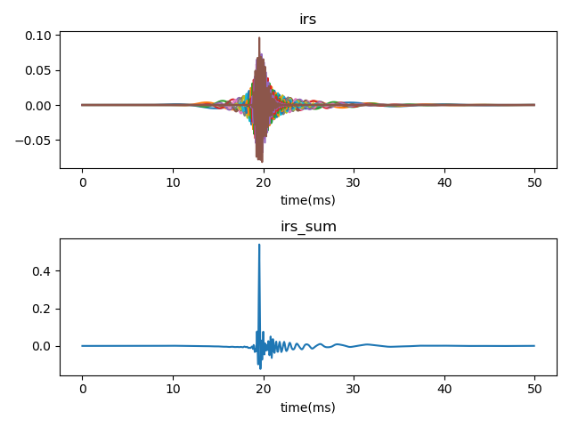

# Gammatone-filters
Python implementation of all-pole Gammatone filter.
The filtering part of code is written in C.

## Basic idea of implementation [^Holdsworth1988]
Gammatone filter can be regarded as low-pass filter with frequency shitfted by fc(center freuqency of filter). Equalently, we can
1. Shift the frequency of input signal by -fc(center frequency of filter);
2. Filter shifted signal with corresponding lowpass filter
3. Shift the frequency of filtered signal back by fc.
!

Details, see [README.pdf](README.pdf), currently written in Chinese, but most part are math equations.

## Filter spectrum

  <center>  </center>

## Gain normalization

  <center>  </center>

  <center>  </center>

  <center>  </center>


## Phase compensation

  Phase compensation is actually to align the peaks of all filter impulse response[^Brown1994].

  The impulse response of Gammatone filter is given as

  $$
  \begin{equation}
  \begin{aligned}
  g(t) = a\frac{t^{n-1}\cos(2\pi f_ct+\phi)}{e^{2\pi b t}}
  \end{aligned}
  \end{equation}\label{gtf_equation}
  $$

  <center>  </center>

  $g(t)$ can be be regarded as production of two parts :
  $$
  \begin{equation}
  \begin{aligned}
   g(t)=g_{amp}(t)\times g_{fine}(t)
  \end{aligned}
  \end{equation}
  $$
  - Envelope parts:  $\quad g_{amp}(t) = a\frac{t^{n-1}}{e^{2\pi b t}}$
  - Fine structure part: $\quad g_{fine}(t) = \cos(2\pi f_ct+\phi)$

  ### Envelope alignment
  The peak position $t_{peak}$ can be obtained by setting first-order derivative of $g_{amp}(t)$ to 0
  $$
  \begin{equation}
  \begin{aligned}
  \frac{\partial g_{amp}(t)}{\partial t} &= \frac{(n-1)t^{n-2}}{e^{2\pi bt}}-\frac{t^{n-1}2\pi b}{e^{2\pi bt}}\\
  &=\frac{t^{n-2}}{e^{2\pi bt}}(n-1-2\pi bt) \triangleq 0\\
  \Rightarrow& \quad t_{peak}=\frac{(n-1)}{2\pi b}
  \end{aligned}
  \end{equation}
  $$

  Delay $g_{amp}$ by $-t_{peak}$ to align the peaks of filter bank
  $$
  \begin{equation}
  \begin{aligned}
  g_{align}(t) = g_{amp}(t-\tau)g_{fine}(t)
  \end{aligned}
  \end{equation}
  $$

  Example of $g_{align}$ ($\phi$ is set to 0)
  <center>  </center>

  ### Fine structure alignment
  Further more, align $g_{fine}(t)$

  $$
  \begin{equation}
  \begin{aligned}
  & \cos(2\pi f_ct+\phi)|_{t=t_{max}} \triangleq 1\\
  \Rightarrow& \quad  \phi = -\frac{(n-1)f_c}{b}+i2\pi, \quad i=0,\pm 1,\cdots
  \end{aligned}
  \end{equation}
  $$

  <center> </center>

  ### Illustration of purpose of alignment

  For a stimulus of impulse, what if we add up all filter outpus ?  Ideally, a impulse is expected
    <table>
    <tr>
    <td align=center> Not aligned </td>
    <td align=center> Envelope aligned </td>
    <td align=center> Envelop & fine structure aligned </td>
    </tr>
    <tr>
    <td> <center>  </center> </td>
    <td>   <center>  </center> </td>
    <td>   <center> </center> </td>
    </tr>
    </table>

## Example

  ```
  │   diagram.odp
│   gtf.c
│   gtf.py
│   libgtf.so
│   README.md
│   README.pdf
│
├───examples
│       efficiency.py
│       filter_spectrum.py
│       gain_normalization.py
│       phase_compensation.py
│       stimulus_restore.py
│
└───images
    ├ ....
  ```


  <!-- Next, I want to make summary about signal recovery after filtered by Gammatone filters.[Flag] -->

### About efficiency

code
```shell
 $ python GTF.py efficiency

 time consumed(s)
    c         :0.39
    python    :36.23
```


[^Holdsworth1988]: Holdsworth, John, Roy Patterson, and Ian Nimmo-Smith. Implementing a GammaTone Filter Bank

[^Brown1994]: G. J. Brown and M. P. Cooke (1994) Computational auditory scene analysis. Computer Speech and Language, 8, pp. 297-336


<!-- Gammatone滤波器冲击响应（Impulse response,IR）：

$$
g(t) = \frac{at^{n-1}\cos(2\pi f_ct+\phi)}{e^{2\pi b t}}
$$

其中:

- $f_c$：中心频率
- $b$ ：带宽，$1.019*ERB(f_c)$


## 中心频率处的增益和相移

$g(t)$ 可分解为两部分的乘积，即
$$
g(t)=a \times r(t) \times s(t)
$$
其中
$$
\begin{align}
r(t)&=t^{n-1}e^{-2\pi bt}\\
s(t)&=cos(2\pi f_c t+\phi)
\end{align}
$$

时域相乘==频域卷积，即：
$$
G(f)=a\times R(f)*S(f)
$$

可以分别计算 $R(f)$ 和 $S(f)$ ，即：
$$
\begin{equation}
\begin{aligned}
R(f)=FT(t^{n-1}e^{-2\pi b t})
&=\frac{1}{(j2\pi)^{n-1}}\frac{\partial^{n-1} FT(e^{-2\pi bt})}{\partial f^{n-1}}\\
&=\frac{1}{(j2\pi)^{n-1}}\frac{\partial^{n-1}\frac{1}{2\pi b+j2\pi f}}{\partial f^{n-1}}\\
&=\frac{1}{(j2\pi)^{n-1}}\frac{(j)^{n-1}(n-1)!}{2\pi}\frac{1}{(b+jf)^n}\\
&=\frac{(n-1)!}{(2\pi b)^n}\frac{1}{(1+jf/b)^n}
\end{aligned}
\end{equation}
$$

$$
\begin{equation}
\begin{aligned}
S(f)=FT\left(cos(2\pi f_ct+\phi)\right)
&=e^{j\phi}\delta(f-f_c)+e^{-j\phi}\delta(f+f_c)
\end{aligned}
\end{equation}
$$
所以有
$$
\begin{equation}
\begin{aligned}
G(f)&=a \times R(f)*S(f)\\
&=a \times e^{j\phi}\frac{(n-1)!}{(2\pi b)^n}\frac{1}{(1+j(f-f_c)/b)^n}+ae^{-j\phi}\frac{(n-1)!}{(2\pi b)^n}\frac{1}{(1+j(f+f_c)/b)^n}\\
&=a\frac{(n-1)!}{(2\pi b)^n}\left[e^{j\phi}\left(\frac{1}{(1+j(f-f_c)/b)}\right)^n+e^{-j\phi}\left(\frac{1}{(1+j(f+f_c)/b)}\right)^n\right]
\end{aligned}
\end{equation}
$$
对于中心频率处，有
$$
\begin{equation}
\begin{aligned}
\left.G(f)\right|_{f=f_c}&=\left.a\frac{(n-1)!}{(2\pi b)^n}\left[e^{j\phi}\left(\frac{1}{(1+j(f-f_c)/b)}\right)^n+e^{-j\phi}\left(\frac{1}{(1+j(f+f_c)/b)}\right)^n\right]\right|_{f=f_c}\\
&=a\frac{(n-1)!}{(2\pi b)^n}\left[e^{j\phi}+e^{-j\phi}\frac{1}{(1+2jf_c/b)^n}\right]\\
&=a\frac{(n-1)!}{(2\pi b)^n}\left[e^{j\phi}+e^{-j\phi}\frac{1}{(1+2jQ)^n}\right]
\end{aligned}
\end{equation}
$$
通常 $cos(2\pi f_c t+\phi)$ 中的起始相位 $\phi$ 为0，即：
$$
\begin{equation}
\begin{aligned}
Gain(f=f_c)&=\frac{(n-1)!}{(2\pi b)^n }\left[1+\frac{1}{(1+j2Q)^n}\right]\\
&=\frac{6}{(2\pi b)^4}\left[1+\frac{1}{(1+j2f/b)^4}\right]\\
&=\frac{6}{(2\pi b)^4}\left[1+\frac{1}{(1-4Q^2+4jQ)^2}\right]\\
&=\frac{6}{(2\pi b)^4}\left[1+\frac{1}{1-8Q^2+16Q^4-16Q^2+2(1-4Q^2)4jQ}\right]\\
&=\frac{6}{(2\pi b)^4}\left[1+\frac{1}{16Q^4-24Q^2+1+8jQ(1-4Q^2)}\right]\\
&=\frac{6}{(2\pi b)^4}\left[\frac{16Q^4-24Q^2+2+8jQ(1-4Q^2)}{16Q^4-24Q^2+1+8jQ(1-4Q^2)}\right]\\
&=\frac{3}{(2\pi b)^4}\frac{r_1e^{\phi_1}}{r_2e^{\phi_2}}\\
\end{aligned}
\end{equation}
$$
其中
$$
\begin{equation}
\begin{aligned}
\begin{cases}
r_1 = \sqrt{(16Q^4-24Q^2+2)^2+(8Q-32Q^3)^2}\\
\phi_1 = \arctan{\frac{8Q-32Q^3}{16Q^4-24Q^2+2}}\\
r_2 = \sqrt{(16Q^4-24Q^2+1)^2+(8Q-32Q^3)^2}\\
\phi_2 = \arctan{\frac{8Q-32Q^3}{16Q^4-24Q^2+1}}
\end{cases}
\end{aligned}
\end{equation}
$$

$$
\begin{equation}
\begin{aligned}
Gain_{f_c} = \frac{3}{(2\pi b)^4}\frac{\sqrt{(16Q^4-24Q^2+2)^2+(8Q-32Q^3)^2}}{\sqrt{(16Q^4-24Q^2+1)^2+(8Q-32Q^3)^2}}\\
\phi_{f_c} = \arctan{\frac{8Q-32Q^3}{16Q^4-24Q^2+2}}-\arctan{\frac{8Q-32Q^3}{16Q^4-24Q^2+1}}\\
\end{aligned}
\end{equation}
$$ -->
